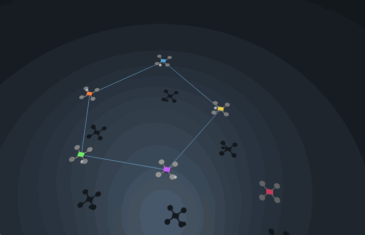

# Drone swarm VLM

A Python / MuJoCo testbed for drone formation control: a three-drone starter
simulation and a six-drone experiment with agents joining and leaving the team.
Includes native MJCF environment loading and measured flight metrics. Python 3.10+;
no ROS, Gazebo, ArduPilot, or GPU required for physics.

## Live MuJoCo demo: agents joining and leaving

Six physical drones demonstrate **five → six → five** team membership. Five form a
pentagon; agent 6 joins at 10 s to form a hexagon; agent 3 leaves at 22 s and flies
to a parking area while the remaining five reform a pentagon. All six remain real
free-joint bodies with bounded rotor thrust throughout the simulation.



*Screen recording of the native MuJoCo viewer, cropped to the viewport and played
at 2× speed, using window captures sampled at 6 fps. All visible motion comes
from the running physical simulation.*

**What you are seeing:**

- The **pink drone (agent 6)** initially waits outside the team, then joins at
  simulation time 10 s. The five-agent pentagon becomes a six-agent hexagon.
- The **green drone (agent 3)** leaves the team at 22 s and flies to a parking
  position. The remaining five agents reform a pentagon.
- **Blue lines** are current communication links between active members whose
  measured horizontal separation is below 1.65 m. **White dots** mark desired
  formation slots. The dark silhouettes on the floor are shadows.
- All six drones remain physical MuJoCo bodies, including the waiting and
  departing agents. Membership changes alter coordination, not the body count.

**How it works:** a neighbour-consensus controller tracks relative formation
positions, with one leader anchoring translation. A centralized quadratic program
filters velocity references using speed bounds, pairwise separation constraints
and a retained communication tree. A low-level velocity/altitude and attitude
controller converts those references into four bounded rotor thrusts per drone;
MuJoCo integrates the six-degree-of-freedom flight dynamics at 500 Hz.

This is a baseline experiment for open multi-agent formation research,
using simplified 250 g quadrotors. It does not implement a calibrated Crazyflie
model or establish a formal safety/stability guarantee for physical flight.

The default measured run has **0.573 m minimum physical separation**, **no contact
steps**, and a connected active graph throughout (minimum Laplacian λ₂ = 0.382).
Final shape RMS error is **2.9 cm** after centroid alignment; absolute target RMS
is **11.2 cm**. [Plots and complete measurement definitions](docs/open-system-demo.md#measured-outputs)
show both errors, separation and connectivity. These values come from the full
36-second MuJoCo run at its original physics timestep.

Install the demo extras, then run the **actual MuJoCo viewer** on macOS:

```bash
python -m pip install -e '.[dev,demo]'
./.venv/bin/python -m drone_swarm.open_system.macos
```

Linux / Windows: `python -m drone_swarm.open_system --viewer`.
For a faster headless physics run and plots: `python -m drone_swarm.open_system`.
Results are saved to `demo-results/`: formation/safety/connectivity plots, CSV,
JSON summary, and measured MuJoCo trajectory data.

See [research demo](docs/open-system-demo.md) for model, controller, metrics,
and limitations.

## Quick start

```bash
python3 -m venv .venv
source .venv/bin/activate
pip install -e '.[dev]'
drone-swarm --list-environments
drone-swarm --headless --environment warehouse --duration 10
```

Interactive viewer on Linux / Windows:

```bash
drone-swarm --environment warehouse --demo formation --duration 60
```

On **macOS**, the viewer must run through MuJoCo's `mjpython` launcher:

```bash
mjpython -m drone_swarm --environment warehouse --demo formation --duration 60
```

The viewer supports mouse orbit / zoom and MuJoCo's built-in controls. Headless
runs print final positions and targets as JSON. `--duration` is simulation seconds.

## Environments

Two bundled environments: `empty` (ground plane) and `warehouse` (shelves and a
crate). Supply your own native MuJoCo XML, with relative includes and mesh assets:

```bash
drone-swarm --environment /absolute/path/to/scene.xml --headless
# Export the environment with all three drones for inspection:
drone-swarm --environment warehouse --export scene.xml
```

See [environment authoring](docs/environments.md) for the loading contract.
Gazebo `.world` / SDF, USD and arbitrary 3D formats need conversion to MJCF first.

## Python pipeline

```python
from drone_swarm.simulation import SwarmSimulation

sim = SwarmSimulation("warehouse")
sim.set_targets([[-0.8, -0.8, 1.2], [-0.8, 0.8, 1.5], [0.8, 0, 1.2]])
for _ in range(5000):
    sim.step()
positions = sim.positions              # (3, 3) copy, world metres
rgb = sim.render("drone0_camera")      # uint8 RGB; requires an OpenGL context
sim.reset()                           # reset physics, preserve assigned targets
```

Each drone has a forward camera (`drone0_camera` through `drone2_camera`). This
is the extension point for a future VLM: render images, infer tasks, then assign
position targets. **No VLM model or autonomous planner is implemented yet.**

## Project layout

- `src/drone_swarm/`: simulator, quadrotor model, environment loader, CLI.
- `src/drone_swarm/environments/`: bundled native MJCF scenes.
- `tests/`: takeoff, hover, independent targets, reset and custom asset loading.
- `legacy/`: archived original ROS / Gazebo code and setup notes.

## Validation

```bash
pytest
ruff check src tests
ruff format --check src tests
python -m build
```

CI runs these checks plus a headless warehouse demo on Python 3.10 and 3.12.
MuJoCo 3.15+ is required for the scene composition API used here.

## Simulation scope

Drones weigh 250 g with roughly 24 cm rotor-to-rotor extent. Each has a free joint,
four bounded thrust actuators and alternating rotor yaw torque. A position / attitude
controller allocates force and torque to the motors; flight is integrated by MuJoCo.
This is a demonstration model, without motor lag, aerodynamic calibration, battery,
flight firmware, obstacle avoidance or task allocation. Keep spawn areas clear and
choose reachable targets. Environments share a 2 ms timestep and Earth gravity.

MuJoCo installation and macOS viewer guidance: [official Python documentation](https://mujoco.readthedocs.io/en/stable/python.html).
