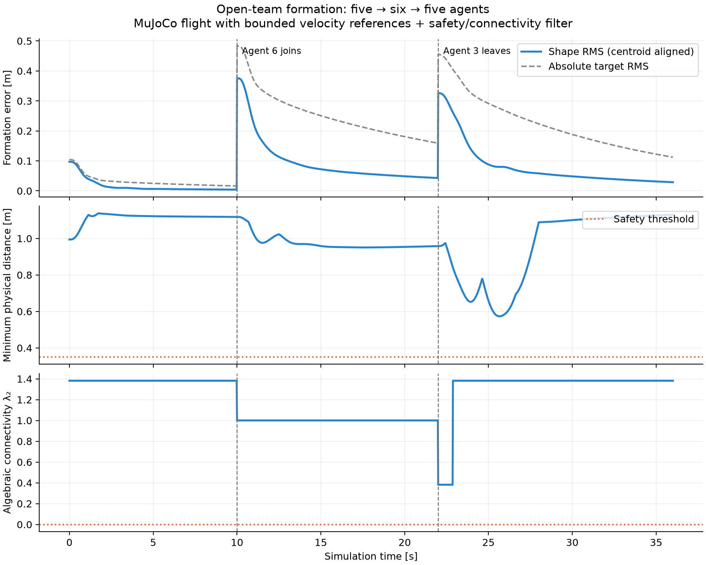
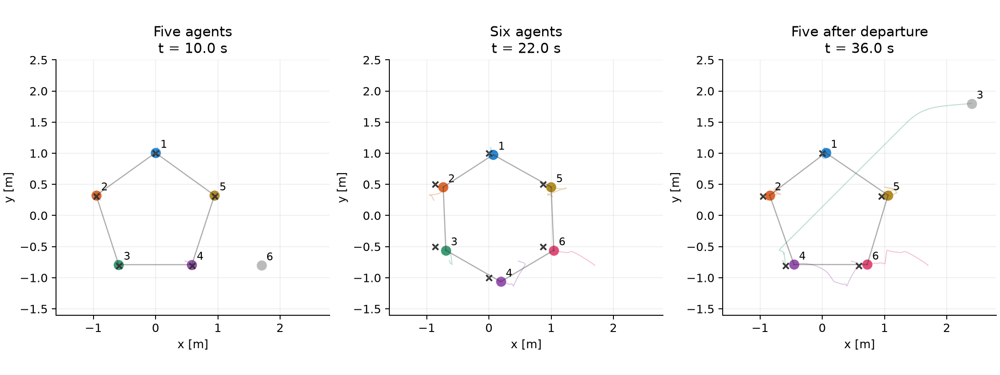

# Open-team formation with six physical MuJoCo quadrotors

This experiment addresses dynamic membership, limited communication, bounded
commands, and the gap between a first-order coordination model and physical flight dynamics.

## Run

From the repository root, with the project virtual environment activated:

```bash
python -m pip install -e '.[dev,demo]'
# macOS live MuJoCo viewer (explicit project interpreter):
./.venv/bin/python -m drone_swarm.open_system.macos --output demo-results
# Headless MuJoCo physics, same experiment, faster than real time:
python -m drone_swarm.open_system --output demo-results
```

The macOS helper invokes MuJoCo's installed native trampoline using the explicit
project Python, preserving virtual-environment imports. It avoids the packaged
`mjpython` script's dependency on Apple's `otool` and the global Anaconda launcher.
It was verified on Homebrew Python 3.12 and an Anaconda Python 3.11 virtual environment.
`python -m drone_swarm.open_system.macos --check` prints the selected interpreter
and MuJoCo version without opening a window.

The live viewer shows all six drones, current sensing links in blue, and target
slots as small white dots. Mouse controls orbit and zoom. Close the viewer to stop;
plots then cover the recorded portion. No HTML animation is used.

## Experiment

- Four-second takeoff/hover stabilization precedes the measured run.
- 0–10 s: agents 1–5 form a pentagon; agent 6 hovers nearby, outside membership.
- 10 s: agent 6 joins; formation targets switch to a hexagon.
- 22 s: agent 3 leaves the communication team and flies to (2.4, 1.8) m.
- 22–36 s: the remaining five reform a pentagon.

Joining/leaving means joining/leaving the coordination network. Bodies do not
teleport, spawn or disappear. Collision checks include waiting and departing drones.
There are six 250 g quadrotors with six degrees of freedom each and 24 thrust
actuators (0–2 N per rotor). They are simplified drones, not calibrated Crazyflie
models. MuJoCo integrates physics at 500 Hz; coordination runs at 50 Hz.

## Control

Nominal coordination uses position-offset consensus over current distance-based
sensing neighbours. One leader pins the formation's translation to the target origin.
Slot assignment at membership changes is centralized and minimizes total travel
cost. A centralized quadratic program filters nominal velocity commands:

- Componentwise reference velocity is bounded to ±0.35 m/s (vector speed may reach
  √2 times that bound). Physical velocity may overshoot; actual speed is logged.
- Pairwise reference-model distance barriers use a 0.35 m safety threshold plus
  a 0.15 m tracking buffer.
- A connected spanning tree is retained between membership changes, with a
  1.60 m edge bound within the 1.65 m sensing range.
- At switches the selected tree must be feasible for both the current positions
  and desired formation; otherwise the demo rejects the switch.

For each safe reference velocity, the low-level controller tracks horizontal
velocity and holds altitude at 1.2 m. It computes attitude and allocates force/torque
to the physical rotor actuators. MuJoCo produces all measured positions and velocities.

The QP models first-order kinematics; a tracking buffer is an engineering mitigation,
not a proof for higher-order flight dynamics. Infeasible QPs stop the experiment.
Membership scheduling and tree selection are centralized, not decentralized protocols.

## Measured outputs

- **Formation shape RMS:** RMS position error after aligning the current and
  desired centroids, over active members only. This isolates formation geometry.
- **Absolute target RMS:** unaligned RMS position error, plotted alongside shape
  error so slow translation convergence remains visible.
- **Minimum physical distance:** Euclidean distance across all 15 physical pairs,
  including non-members. The summary checks every physics step; plots sample at 50 Hz.
- **Graph connectivity:** λ₂ of the unweighted undirected Laplacian, computed
  from actual XY distances among active members within 1.65 m. Positive λ₂ means
  connected for these graphs. Different team sizes are not directly comparable.
- Actual velocity, altitude tracking error, bounded rotor thrust and contact-step
  counts are also logged in `trajectory.npz` / `summary.json`.

Membership switches change the desired slots and the graph dimension, so jumps
in error or λ₂ at 10 s / 22 s are meaningful rather than plotting artifacts.

## Claims and next experiments

The default seeded run is a reproducible demonstration, not a stability proof,
implementation of a specific referenced paper, or hardware validation. The observed
constraints must be rechecked after changing gains, initial positions or switch times.
No signed/directed networks, obstacles or external disturbances are modeled here.

A useful application discussion: compare reference and actual speed; vary dwell
time and actuator limits; test articulation-point departures; investigate when
tracking lag invalidates the first-order barrier assumptions. Those are extensions,
not claims already established by this demo.

## Default measured MuJoCo run (seed 7)





The final formation shape RMS is 0.029 m; absolute target RMS is 0.112 m.
Minimum physical separation is 0.573 m, graph λ₂ stays at or above 0.382,
and no physical contacts occur during the measured run. Maximum actual XY
speed is 0.536 m/s despite the bounded reference components: tracking dynamics
remain visible rather than being replaced with commanded motion.

The complete parameters and metrics are in [summary.json](results/summary.json).
